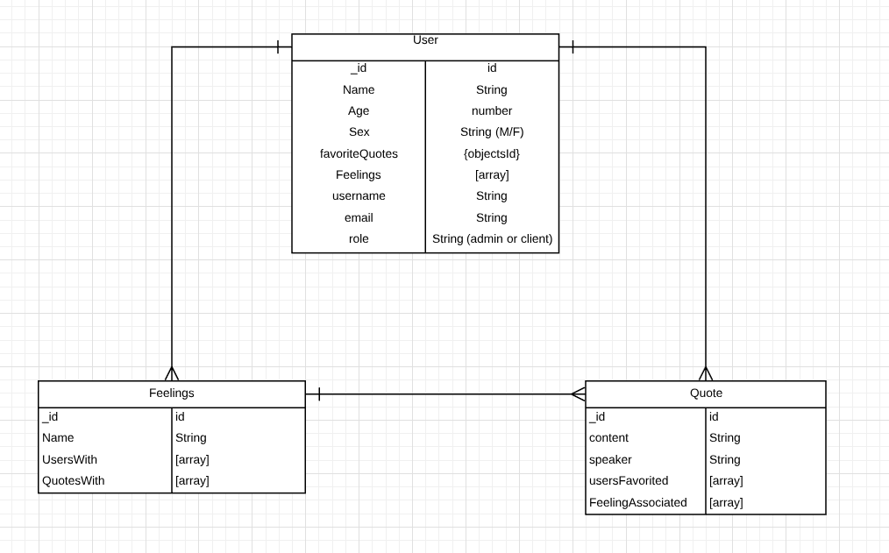

# Inspire
## Description

For this project, I created a social app that aims to turn bad days into good days through motivational inspiration. Sometimes the worst days can be corrected with something simple: something as small as a quote. At Inspire, we provide motivational quotes from some of the most influential people in history to try and cheer users up.

**Live site:** <https://salty-anchorage-65493.herokuapp.com/>

## Technologies Used

  * Languages - HTML5, CSS3, Javascript, jQuery, Nodejs, Express
  * Design - Google Fonts, Bootstrap & Modals, Handlebars
  * Project Planning & User Stories 
  * Visual Studio Code

## Features

  * Bootstrap Modals with shuffle quote feature
  * Full CRUD quote editing

## Wireframe

_Link to figma wireframe:_
[Figma Wireframe](https://www.figma.com/file/g3buY6FwvGFzwg4TMHnwPlch/Inspire-Project-2?node-id=0%3A1)

_Link to workflow Trello Board:_
[Trello Board](https://trello.com/b/C6K0J8Ip/inspire-trello-board)

_Link to gitHub repo:_
[GitHub Repository](https://github.com/Jdale28/connectFour)

 
_ERD User flow_

## Future Development

  * Authorization
  * Roles (Admin and User)
  * Save and favorite quotes to user homepage
  * User-to-User interaction
  * Gif and Audio options in lieu of quotes
  * Cumulator showing current user feeling climate
  * Font shuffler